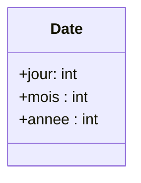

# KaoutarTD
## Exercice 1 :
Un programme principal saisit une chaîne d'ADN valide et une séquence d'ADN valide (valide signifie qu'elles ne sont pas vides et sont formées exclusivement d'une combinaison arbitraire de "a", "t", "g" ou "c").

Écrire une fonction valide qui renvoie vrai si la saisie est valide, faux sinon.

Écrire une fonction saisie qui effectue une saisie valide et renvoie la valeur saisie sous forme d'une chaîne de caractères.

Écrire une fonction proportion qui reçoit deux arguments, la chaîne et la séquence et qui retourne la proportion de séquence dans la chaîne (c'est-à-dire son nombre d'occurrences).

Le programme principal appelle la fonction saisie pour la chaîne et pour la séquence et affiche le résultat.

Exemple d'affichage :
```
chaîne : attgcaatggtggtacatg
séquence : ca
Il y a 10.53 % de "ca" dans votre chaîne.
```

## Exercice 2 :
Soit la classe Date définie par le diagramme de classe UML suivant :





1. Implémenter cette classe en Python.
2. Dans la méthode de construction de la classe, prévoir un dispositif pour éviter les dates impossibles (du genre 32/14/2020). Dans ce cas, la création doit provoquer une erreur, chose possible grâce à l’instruction raise (documentation à rechercher !).
3. Ajouter une méthode `__repr__` permettant d’afficher la date sous la forme "25 janvier 1989". Les noms des mois seront définis en tant qu’attribut de classe à l’aide d’une liste.
4. Ajouter une méthode `__lt__` qui permet de comparer deux dates.
5. L’expression d1 < d2 ( d1 et d2 étant deux objets de type Date ) doit grâce à cette méthode renvoyer True ou False.

## Exercice 3 : Classe Compte bancaire :

1. Créer une classe Python nommée CompteBancaire qui représente un compte bancaire, ayant pour attributs : numeroCompte (type numérique ) , nom (nom du propriétaire du compte du type chaine), solde.
2. Créer un constructeur ayant comme paramètres : numeroCompte, nom, solde.
3. Créer une méthode `Versement()` qui gère les versements.
4. Créer une méthode `Retrait()` qui gère les retraits.
5. Créer une méthode `Agios()` permettant d'appliquer les agios à un pourcentage de 5 % du solde
6. Créer une méthode `afficher()` permettant d’afficher les détails sur le compte
7. Donner le code complet de la classe CompteBancaire.

